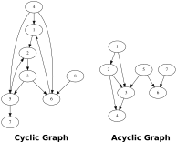

## Topological Sorting Algorithm for Cyclic Graphs

**Version 1.1.0**


[](https://badge.fury.io/py/cyclic-toposort)
[](https://codecov.io/gh/PaulPauls/cyclic-toposort)

Sorting algorithm for cyclic as well as acyclic directed graphs such as those below. A directed graph is cyclic if any node exists within the graph that has a directed path leading to at least 1 other node and then back to the original node again.

<p align="center">
  
</p>

This project provides 2 sorting algorithms for these graphs. A graph is represented as a set of edges with an edge being a 2-tuple describing the start-node and the end-node of an edge. 

`acyclic_toposort` sorts an acyclic graph (or raises a RuntimeError if called on a cyclic graph) into a list of topological groupings. These topological groupings are sets of nodes that are on the same topological level. Nodes in a topological grouping are either dependent on an incoming edge from the prior topological grouping or have no incoming edges if they are in the first topological grouping. 

```python3
def acyclic_toposort(edges: Iterable[tuple[int, int]]) -> list[set[int]]:
    """Create and return a topological sorting of an acyclic graph as a list of sets, each set representing a
    topological level, starting with the nodes that have no dependencies.

    :param edges: iterable of edges represented as 2-tuples, whereas each 2-tuple represents the start-index and end-
        index of an edge
    :return: topological sorting of the graph represented by the input edges as a list of sets that represent each
        topological level in order beginning with all dependencyless nodes.
    :raises RuntimeError: if a cyclic graph is detected.
    """
```

`cyclic_topoosort` on the other hand sorts cyclic graphs and returns a 2-tuple with the first element being the same list of topological groupings that is returned in the `acyclic_toposort` function and the second element being a set of edges that is required to be cyclic in order to make the rest of the graph acyclic. The determined set of cyclic edges is minimal and if the graph is acyclic will be an empty set. If there are multiple sets of cyclic edges that would turn the rest of the graph acyclic and all have the same size then the set of cyclic edges is chosen which enables the acyclic restgraph to be sorted with the least amount of topological groupings. Unfortunately does this algorithm employ full polynomial recursion and can have a runtime of up to O(2^n).

```python3
def cyclic_toposort(
    edges: set[tuple[int, int]],
    start_node: int | None = None,
) -> tuple[list[set[int]], set[tuple[int, int]]]:
    """Perform a topological sorting on a potentially cyclic graph, returning a tuple consisting of a graph topology
    with the fewest topological groupings and a minimal set of cyclic edges.

    :param edges: A set of tuples where each tuple represents a directed edge (start_node, end_node) in the graph.
    :param start_node: An optional node. If provided, any edge leading into this node will be considered as a forced
        cyclic edge.
    :return: A tuple containing:
        - A list of sets representing the topological ordering of nodes. Each set contains nodes at the same depth. The
            amount of topological groupings is minimal out of all possible sets of cyclic edges.
        - A set of tuples representing the cyclic edges that were identified in the graph and that yielded a graph
            topology with the fewest topological groupings.
    """
```


------------------------------------------------------------------------------------------------------------------------

### Installation & Example Usage

Install `cyclic-toposort` via pip or your preferred Python package manager:

```shell
pip install cyclic-toposort
```

The following examples encode the cyclic and acyclic graphs displayed above and show the usage of cyclic-toposort as a package:

``` python
>>> from cyclic_toposort import cyclic_toposort, acyclic_toposort

>>> cyclic_graph_edges = {(1, 2), (2, 3), (3, 5), (3, 6), (4, 1), (4, 5), (4, 6), (5, 2), (5, 7), (6, 1), (8, 6)}
>>> cyclic_toposort(cyclic_graph_edges)
([{8, 3, 4}, {5, 6}, {1, 7}, {2}], {(2, 3)})
>>> cyclic_toposort(cyclic_graph_edges, start_node=2)
([{8, 2, 4}, {3}, {5, 6}, {1, 7}], {(1, 2), (5, 2)})

>>> acyclic_toposort_edges = {(1, 2), (1, 3), (2, 3), (2, 4), (3, 4), (5, 3), (5, 6), (7, 6)}
>>> acyclic_toposort(acyclic_toposort_edges)
[{1, 5, 7}, {2, 6}, {3}, {4}]
```


------------------------------------------------------------------------------------------------------------------------

### Correctness and Performance

Since I am unable to formerly validate the specifications of my algorithms have I opted to prove the correctness of the cyclic sorting algorithm by randomly generating cyclic graphs, sorting them with the algortihms and verifying the correctness of the results by testing them against a bruteforce sorting method that takes a long time though is able to calculate all correct results. The random graphs are generated with the following parameters:

``` python
CYCLIC_NODES_PROBABILITY = 0.2
START_NODE_PROBABILITY = 0.2

num_edges = random.randint(8, 16)
cyclic_nodes = random.random() < CYCLIC_NODES_PROBABILITY
edges = create_random_graph(
    num_edges=num_edges, 
    cyclic_nodes=cyclic_nodes
)
start_node = None
if random.random() < START_NODE_PROBABILITY:
    start_node = random.choice(list(edges))[0]
```

This verification process is repeated 1000 times in the test files and yielded the following average processing times for the sorting algorithms given the graphs generated with the parameters above. The average processing times were calculated on a Ryzen 5 2600X (6 x 3.6Ghz) using Python 3.10.11:

`cyclic_toposort` mean. time: 0.2439s   (std. dev: 2.658s)


------------------------------------------------------------------------------------------------------------------------

### Dev Comments

* The cyclic sorting algorithm is slow when applied to graphs that are fully cyclic (each node has at least 1 incoming and at least 1 outgoing edge). The Bruteforce method is surprisingly quick when the graph is fully cyclic.

* The implementation has considerable speed up potential by using multithreading, which however would require coordination of the multitude of recursively spawned threads. Since the algorithm relies heavily on recurstion and CPython is known to be slow and ressource-hungry on recursion have I not bothered in parallelizing the implementation for the maximum attainable speed since a proper implementation would require a low-level programming language like C++ or Rust anyway. If the project will be well received and gains some actual use then I hope to find the time to implement this project in Rust and make Python bindings available.

* I would be thankful for feedback, issues (with reproducing code) or even concrete ideas or code for improvement


------------------------------------------------------------------------------------------------------------------------

### Known Issues

None
