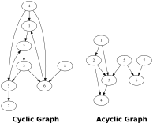

## Topological Sorting Algorithm for Cyclic Graphs ##

**Version 1.0.0**


[](https://badge.fury.io/py/cyclic-toposort)
[](https://codecov.io/gh/PaulPauls/cyclic-toposort)

Sorting algorithm for cyclic as well as acyclic directed graphs such as those below. A directed graph is cyclic if any node exists that has a directed path leading to another node and back to the origin node.

<p align="center">
  
</p>

The project provides three sorting algorithms for these graphs. `cyclic_topoosort` sorts a cyclic graph and returns a 2-tuple with the first element being a list of ordered nodes and the second element being a set of 2-tuples that are the cyclic edges. The set of cyclic edges is minimal and if the graph is acyclic will be an empty set. `cyclic_toposort_groupings` functions identical though will return as the first element of the 2-tuple an ordered list of sets of nodes, representing topological levels that can be visited at the same time. The set of cyclic edges is also minimal with the groupings variant and empty if the graph is acyclic. `acyclic_toposort` sorts only acyclic graphs and returns an ordered list of sets of nodes, again representing the topological levels.


------------------------------------------------------------------------------------------------------------------------

### Example Usage ###

The following examples encode the cyclic and acyclic graphs displayed above:

``` python
>>> edges = {(1, 2), (2, 3), (3, 5), (3, 6), (4, 1), (4, 5), (4, 6), (5, 2), (5, 7), (6, 1), (8, 6)}
>>> cyclic_toposort(edges)
([8, 3, 4, 5, 6, 1, 7, 2], {(2, 3)})
>>> cyclic_toposort_groupings(edges)
([{8, 3, 4}, {5, 6}, {1, 7}, {2}], {(2, 3)})
>>> cyclic_toposort_groupings(edges, start_node=2, end_node=5)
([{8, 2, 4}, {3}, {6}, {1, 5}], {(1, 2), (5, 7), (5, 2)})


>>> edges = {(1, 2), (1, 3), (2, 3), (2, 4), (3, 4), (5, 3), (5, 6), (7, 6)}
>>> acyclic_toposort(edges)
[{1, 5, 7}, {2, 6}, {3}, {4}]
```


------------------------------------------------------------------------------------------------------------------------

### Correctness and Performance ###

Since I am unable to formerly validate the specifications of my algorithms have I opted to prove the correctness of the cyclic sorting algorithm by randomly generating cyclic graphs, sorting them with the algortihms and verifying the correctness of the results by testing them against a bruteforce sorting method that takes a long time though is able to calculate all correct results. The random graphs are generated with the following parameters:

``` python
num_edges = random.randint(8, 16)
start_node = random.choice([None, random.randint(1, 5)])
end_node = random.choice([None, random.randint(6, 10)])
full_cyclic_graph = False
cyclic_nodes = random.choice([True, False])
nodes, edges = test_utils.create_random_graph(num_edges=num_edges,
                                              start_node=start_node,
                                              end_node=end_node,
                                              full_cyclic_graph=full_cyclic_graph,
                                              cyclic_nodes=cyclic_nodes)
```

This verification process is repeated 1000 times in the test files and yielded the following average processing times for the sorting algorithms given the graphs generated with the parameters above. The average processing times were calculated on a Ryzen 5 2600X (6 x 3.6Ghz):

`cyclic_toposort` mean. time: 0.4936s   (std. dev: 2.6189s)

`cyclic_toposort_groupings` mean. time: 0.8320s   (std. dev: 4.3270s)


------------------------------------------------------------------------------------------------------------------------

### Dev Comments ###

* The cyclic sorting algorithms are slow when applied to graphs that are fully cyclic (each node has at least 1 incoming and at least 1 outgoing edge). The Bruteforce method is surprisingly quick when the graph is fully cyclic.

* The implementaiton has further considerable speed up potential by using multithreading as it is currently single-threaded while being easily parallelizable. The algorithm would also benefit if implemented in a lower level programming language as it relies heavily on recursion and CPython is known to be ressource-hungry on recursion. If the project will be well received and gains some users then I will optimize the implementation (and possibly algorithm) more.

* I would be thankful for feedback, issues (with reproducing code) or even concrete ideas or code for improvement


------------------------------------------------------------------------------------------------------------------------

### Known Issues ###

None
